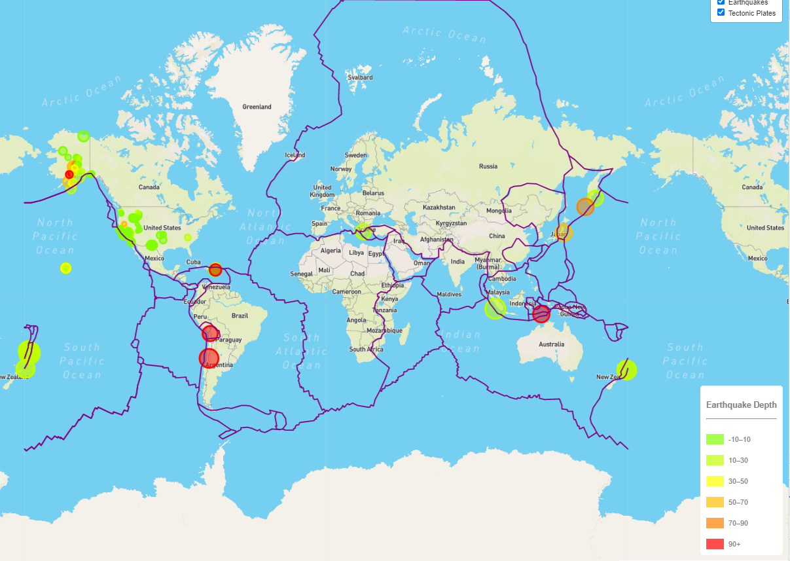

# Mapping Earthquake Data Using Leaflet

In this exercise, geoJSON data is read in from the United States Geological Survey (USGS) and plotted on a map of the world.  Data on tectonic plates is pulled from <https://github.com/fraxen/tectonicplates>.

The data displayed shows all of the earthquakes, worldwide, that occurred in the past day.  The data feed is refreshed every minute, so the data is up-to-date with every map refresh.

The depth of the earthquake is indicated by the color of the circle, with a legend in the bottom right corner.

The size of the circle provides an indication of magnitude.  The larger the circle,  the higher the magnitude of the earthquale.

In some cases, circles appear more solid than others.  This is due to several earthquakes happening in the same or similar location within the past day, so multiple circles are overlapping.

The user can toggle on or off the streetmap or dark map layer.

The user may also choose to toggle on or off the earthquake data and the tectonic plate data.  These feastures are in the upper right of the screen.